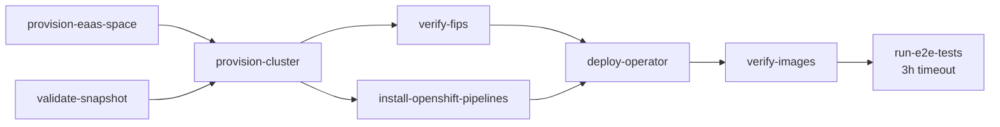

# Openshift Builds Release Tooling
This repository contains the required manifests and tooling to support release for Builds for Red Hat OpenShift.

## Konflux
Currently, Konflux is being used to building the container, running tests and releasing.

To manage multiple versions of an application, Konflux features a template to create the required components in the platform. 

### Prerequisite 
- kubectl
- kustomize
- yq

### Setup
This will create the `Project`, `ProjectDevelopmentStreamTemplate`.
```shell
make setup
```

### Release
This will create the release stream definition, `ProjectDevelopmentStream`.
```shell
# For creating Konflux resources for OpenShift Builds Operator
export OPENSHIFT_BUILDS_VERSION="1.1"
make operator-release 

# For creating Konflux resources for OpenShift Builds Catalog
export OPENSHIFT_VERSION="4.15"
make catalog-release 
```
Set the release stream version accordingly.
This will create the `Application` with the following name.
- `openshift-builds-1-1`

and `Component` with the following names
- `openshift-builds-controller-1-1`
- `openshift-builds-operator-1-1`

and `ImageRepository` with the following names
- `openshift-builds-operator-1-1`
having URL `quay.io/redhat-user-workloads/rh-openshift-builds-tenant/openshift-builds-operator-1-1`

The components will be mapped to the application.

### Update Pipelines
This process doesn't create the tekton pipelines under the z-stream branch of the repository. Hence, konflux pipelines need to be copied or created there.
If the pipelines are copied from another branch update the following fields to map the correct application and components.

Update the labels to point to the correct application and component
```yaml
labels:
    appstudio.openshift.io/application: openshift-builds-1-1
    appstudio.openshift.io/component: openshift-builds-operator-1-1
```

Update the branch to the current release branch.
```yaml
metadata:
  annotations:
    pipelinesascode.tekton.dev/on-cel-expression: event == "push" && target_branch == "builds-1.1"
```

Update the `output-image` accordingly
quay.io/redhat-user-workloads/rh-openshift-builds-tenant/openshift-builds-fbc-4-12:on-pr-{{revision}}
```yaml
- name: output-image
  value: quay.io/redhat-user-workloads/rh-openshift-builds-tenant/openshift-builds-operator-1-1:on-pr-{{revision}}
```

## E2E Integration Test Pipeline

The `e2e-openshift-builds` pipeline (`pipelines/konflux-e2e-complete-pipeline.yaml`) provisions an ephemeral Hypershift cluster, deploys the OpenShift Builds operator from a Konflux snapshot, and runs the full e2e test suite.

### Pipeline Parameters

| Parameter | Default | Description |
|-----------|---------|-------------|
| `SNAPSHOT` | test app JSON | Konflux snapshot JSON containing component names and container images. Provided automatically by Konflux integration tests. |
| `VERSION` | `""` | Version suffix for image content source mirrors (e.g. `-1-6`). Used to construct the ICSP entries that map `registry.redhat.io` images to Konflux-built mirrors. |
| `TASKS_REPO_URL` | `https://github.com/redhat-openshift-builds/release.git` | Git repository URL containing the e2e task definitions. Override this to test tasks from a fork. |
| `TASKS_REPO_REVISION` | `main` | Git revision (branch, tag, or commit SHA) for the e2e task definitions. Override this alongside `TASKS_REPO_URL` when testing task changes before merging. |
| `BUILDS_SAMPLES_REPO` | `https://github.com/redhat-openshift-builds/builds-samples.git` | Repository containing sample Build and BuildRun manifests used for smoke testing before the full e2e suite. |
| `BUILDS_SAMPLES_BRANCH` | `main` | Branch to clone from the builds samples repository. |
| `SHIPWRIGHT_BUILD_REPO` | `https://github.com/shipwright-io/build.git` | Shipwright Build repository containing the ginkgo e2e test suite and sample build strategies. |
| `SHIPWRIGHT_BUILD_BRANCH` | `main` | Branch to clone from the Shipwright build repository. |

### Execution Flow



- **validate-snapshot** runs immediately and fails fast if snapshot images are missing or the bundle was built with stale component digests.
- **verify-fips** and **install-openshift-pipelines** run in parallel after cluster provisioning.
- **deploy-operator** waits for both to complete before deploying the operator bundle.

### Task Definitions

All e2e task definitions are stored under `tasks/` and referenced via git resolver:

| Task File | Description |
|-----------|-------------|
| `tasks/e2e-validate-snapshot.yaml` | Pre-cluster validation of snapshot images and bundle relatedImages |
| `tasks/e2e-provision-cluster.yaml` | Provisions an ephemeral Hypershift cluster with FIPS and ICSP configuration |
| `tasks/e2e-verify-fips.yaml` | Verifies FIPS is enabled on all cluster worker nodes |
| `tasks/e2e-install-openshift-pipelines.yaml` | Installs OpenShift Pipelines operator via OLM subscription |
| `tasks/e2e-deploy-operator.yaml` | Deploys the operator bundle, verifies operands and CR status |
| `tasks/e2e-verify-images.yaml` | Verifies running operand images match the snapshot |
| `tasks/e2e-run-tests.yaml` | Runs sample BuildRuns and the Shipwright ginkgo e2e test suite |

### Testing with a Fork

To test task changes before merging to the release repository, override the task source parameters:

```yaml
params:
  - name: TASKS_REPO_URL
    value: "https://github.com/<your-fork>/release.git"
  - name: TASKS_REPO_REVISION
    value: "your-feature-branch"
```
